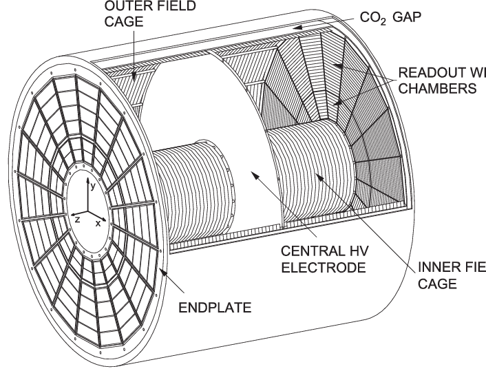

# TPC distorsion calibration with Deep Networks

## Overview of the software:
This software is meant at providing a fast way for performing space-charge (SC) distorsion corrections using deep networks. In particular, the current version uses UNet to train an input dataset made of SC densities and fluctuations and try to predict distorsions along the R, phi and z axis. 

Authors: M. Ivanov (marian.ivanov@cern.ch), G.M. Innocenti (ginnocen@cern.ch), Rifki Sadikin (rifki.sadikin@cern.ch), D. Sekihata (daiki.sekihata@cern.ch)

The original version of the code was developed by M. Ivanov and R. Sadikin and can be found here https://gitlab.cern.ch/alice-tpc-offline/alice-tpc-notes/-/tree/master/JIRA%2FATO-439%2Fcode%2Fpython

Please find detailed instruction about the analysis and the software package here https://github.com/AliceO2Group/TPCwithDNN/wiki

## [BARU] Jalur struktural TDL+PINN - v4 (Hodge-U-Net + epoch sejati)
Perubahan thd kode asli HANYA: (1) loss fisika PINN (residual Hodge),
(2) U-Net CNN -> jaringan TDL. v4 memakai BENTUK autoencoder encoder-decoder
ala U-Net asli dengan lapisan Hodge (kunci: network: hodge_unet); arsitektur
datar v3 tetap tersedia utk ablasi (network: hodge_flat). Loop training =
kunci `epochs` ASLI. Antarmuka data = format .npy TPCwithDNN asli (data yang
sama jalan di kode asli maupun kode ini).
- Data riil : dirinput_* + grid 180/33/33 (folder SC-33-33-180), dnn.synthetic: false
- Create-data sendiri: dnn.synthetic: true (synthetic_mode: mc = MC statistik Pers.1)
- Jalankan  : `PYTHONPATH=.. python3 steer_analysis.py --dotrain`; apply via default.yml
